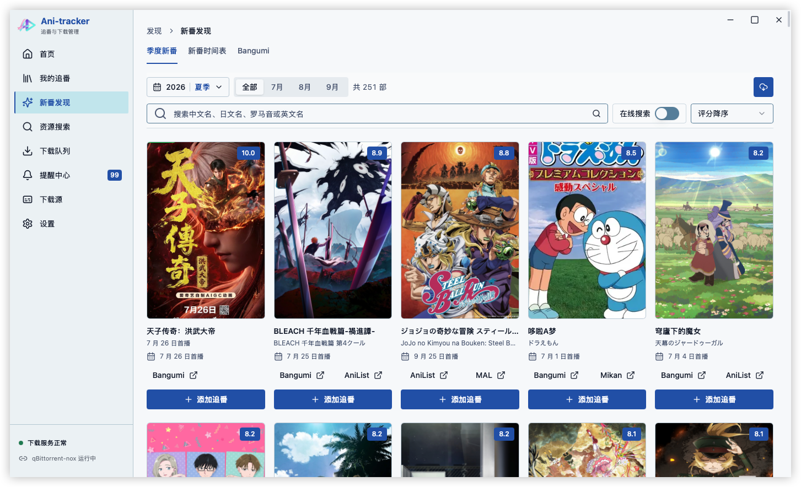
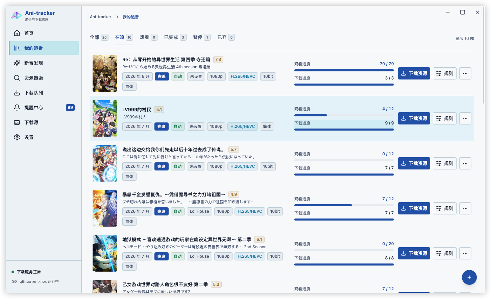
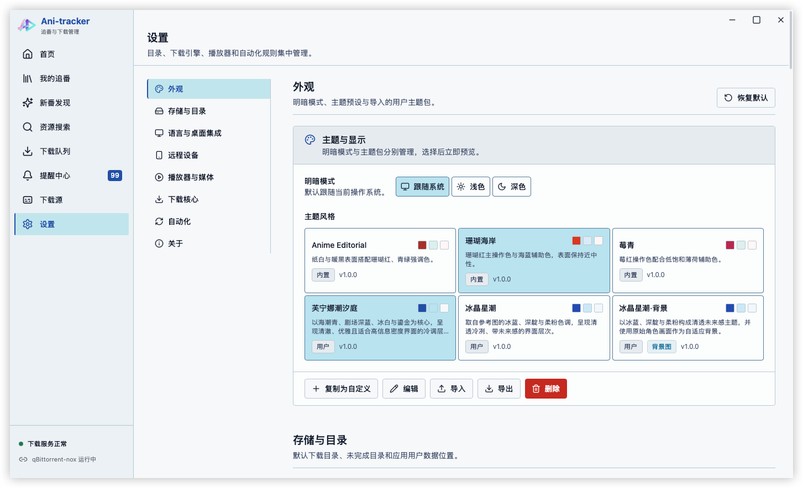
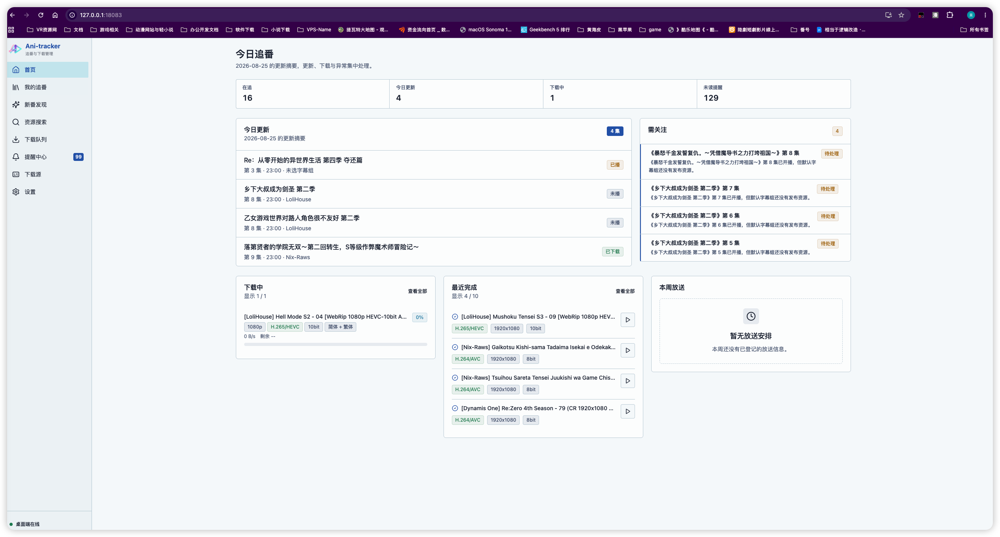

# Ani Tracker

[中文](README.md) · [English](README.en.md)

Ani Tracker is a Tauri 2 local-first anime tracker, release search, BT download manager, and media player for Windows, macOS, Linux, Android, and iOS/iPadOS.

The desktop app provides the complete business workflow, media scanning, transcoding, remote HTTPS gateway, and system integration. Mobile builds keep discovery, tracking, sources, search, built-in downloads, native playback, reminders, settings, and themes, while excluding the desktop-only remote web/gateway, FFmpeg/FFprobe, transcoding, and system integration features.

> Copyright (c) 2026 Ani Tracker contributors. The source code is publicly available for personal and other non-commercial use only. Commercial use requires written permission from the copyright holder.

## Core capabilities

- Anime discovery: merged Bangumi, AniList, and Mikan metadata with season, month, search, and refresh workflows.
- Tracking: status, episodes, fansub groups, automatic downloads, quality, codec, subtitle language, and directory preferences.
- Release search: RSS, Torznab, DMHY, Mikan, AniBT, ACGNX, Nyaa, and ACG.RIP with rate limiting, caching, circuit breaking, and candidate scoring.
- Downloads: built-in libtorrent `torrent-core`, external qBittorrent Web API, and managed qBittorrent-nox on desktop.
- Playback: the desktop app uses a single `libmpv` backend with hardware decoding, `gpu-next`, subtitles and audio tracks, speed, aspect ratio, resume, watched state, and automatic next episode; Android and iOS use their native player adapters.
- Video enhancement: desktop Anime4K, FSRCNNX, and ArtCNN shaders, RIFE interpolation, Real-ESRGAN anime upscaling, HDR capability detection, and runtime dropped-frame fallback; the remote PWA has separate HLS/direct-enhancement paths and falls back to the original stream when needed.
- Automation: incremental source sync, automatic scanning, automatic downloads, local notifications, and a reminder center.
- Themes: system, light, dark, built-in, and imported/exported custom themes with shared semantic tokens across desktop and mobile.
- Desktop-only integrations: FFmpeg/FFprobe, media scanning, remote HTTPS gateway, remote PWA, tray, startup launch, external players, and file manager integration.

## Playback and enhancement architecture

Desktop local playback moved from libVLC to a single `libmpv` backend, so one PC session does not switch between multiple playback cores. The playback pipeline is:

```text
Local media
  -> libmpv hardware decoding
  -> gpu-next
  -> Anime4K / FSRCNNX / ArtCNN shaders or model enhancement
  -> optional RIFE interpolation and HDR
  -> subtitle / OSD composition after enhancement
  -> native video window
```

- Windows uses native windows with D3D11 and D3D11VA; macOS uses the libmpv Render API; Linux initially supports X11/XWayland, Vulkan, and VAAPI.
- The `balanced` and `clear` presets are enabled only when resources and playback load permit. Sustained dropped frames trigger an automatic quality fallback, and snapshots record the active preset and reason.
- RIFE and Real-ESRGAN run through independent model sidecars. Real-time interpolation is currently capped at 2x; missing model, encoder, or hardware capability preserves the original timeline and falls back safely.
- The remote PWA uses an independent ArtPlayer/HLS session. Direct enhancement uses browser WebCodecs/WebGPU and is attempted only after capability detection; failures fall back to the original direct stream or HLS.
- Android and iOS keep platform-native player adapters. They do not load the desktop remote page or package desktop FFmpeg/FFprobe and transcoding resources.

## Architecture

```text
React / TypeScript / Tailwind / shadcn UI
                  |
               AppClient
                  |
          Tauri invoke / events
                  |
ani-contracts / ani-domain / ani-repository
ani-storage / ani-sources / ani-downloads
ani-media / ani-automation / ani-remote
                  |
SQLite / torrent-core / libmpv / platform adapters
                  |
 Anime4K / model sidecars / remote HLS
```

Application services depend on the Repository Ports and UnitOfWork in `ani-repository`, not on SQLite types. SQLite is the default local adapter for desktop and mobile; a future MySQL implementation should be an independent adapter or server-side store without changing Tauri commands, `AppClient`, or pages.

React pages access business capabilities only through `AppClient`. Mobile builds never fall back to the desktop remote page, and the desktop remote PWA has no local command privileges.

## Technology

- Tauri 2, Rust 1.97, React 18, TypeScript, and Vite
- Tailwind CSS, shadcn/ui-style components, and lucide-react
- SQLite, Repository Ports, versioned migrations, and backups
- libtorrent-rasterbar, qBittorrent Web API, and qBittorrent-nox
- Desktop `libmpv`, `gpu-next`, D3D11/VAAPI/VideoToolbox; native player adapters on Android/iOS
- Anime4K, FSRCNNX, ArtCNN, RIFE, and Real-ESRGAN; browser WebCodecs/WebGPU direct enhancement
- Desktop FFmpeg/FFprobe, ArtPlayer, and hls.js
- pnpm, Cargo, and Node.js `node:test`

## Key directories

```text
src-tauri                         Tauri host, commands, lifecycle, and platform assembly
crates/ani-*                     Rust contracts, domain, repositories, storage, sources, downloads, and media
crates/tauri-plugin-ani-*        Android/iOS torrent, player, and platform plugins
src/renderer/src                 Desktop/mobile React UI and the desktop remote PWA
src/shared                       Shared TypeScript domain models and contracts
native/torrent-core              C++ runtime shared by desktop sidecar and mobile native core
resources                        libmpv, enhancement models, shaders, FFmpeg, qBittorrent, and license resources
archive/legacy-hosts             Retired Electron/Capacitor hosts kept for read-only reference
docs                             Architecture, startup, release, progress, and focused plans
```

## Screenshots

### Anime discovery

Browse seasonal anime by month, rating, or keyword, inspect Bangumi/AniList/Mikan sources, and add a title to tracking.



### My tracking list

Manage tracking status, watch progress, download progress, fansub groups, and per-title rules in one place.



### Settings

Manage themes, directories, language and desktop integration, playback and media, download engines, and automation rules.



### Web client

The desktop app can host a remote HTTPS PWA for tracking updates, download tasks, reminders, and recently completed episodes.



## Requirements

Recommended: Node.js 22, pnpm 10.34.5, and Rust 1.97.1. See [Startup guide](docs/startup.md) for desktop native dependencies and mobile toolchains.

```powershell
pnpm.cmd install --frozen-lockfile
```

Desktop playback is provided by `libmpv`. Windows and macOS use the runtime prepared by the project; Linux initially uses system `libmpv`. Run the platform-specific preparation script when setting up a development machine.

## Common commands

```powershell
# Desktop development and build
pnpm.cmd dev
pnpm.cmd build
pnpm.cmd run package:desktop

# Renderer
pnpm.cmd run dev:tauri:renderer
pnpm.cmd run build:tauri:desktop-renderers

# Desktop player and enhancement resources
pnpm.cmd run prepare:tauri:desktop-runtime
pnpm.cmd run verify:libmpv
pnpm.cmd run verify:pc-enhancement-resources
pnpm.cmd run test:player-matrix

# Android / iOS
pnpm.cmd run dev:tauri:android
pnpm.cmd run package:tauri:android
pnpm.cmd run dev:tauri:ios
pnpm.cmd run package:tauri:ios

# Gates
pnpm.cmd run typecheck
pnpm.cmd run test:parsers
pnpm.cmd run test:theme
pnpm.cmd run test:rust
pnpm.cmd run lint:rust
```

`dev`, `build`, and `package:desktop` use Tauri as the only formal host. Electron/Capacitor sources and dependencies are outside the active build; see [retired hosts](archive/legacy-hosts/README.md) for the last rollback point and dependency inventory.

## Platform boundaries

| Capability | Desktop | Android / iOS |
| --- | --- | --- |
| Local SQLite, tracking, sources, and search | Supported | Supported |
| Built-in torrent-core | Supported | Supported |
| External qBittorrent Web API | Supported | Supported |
| Managed qBittorrent-nox | Supported | Not applicable |
| Built-in playback | `libmpv` | Native platform player adapters |
| Shader, model enhancement, and runtime fallback | Supported | Adapted per platform capability |
| Themes and local notifications | Supported | Supported |
| FFmpeg, FFprobe, scanning, and transcoding | Supported | Not packaged |
| Remote HTTPS gateway and remote PWA | Supported | Not packaged |
| Tray, startup launch, and external player paths | Supported | Not applicable |

Mobile apps can independently discover, track, search, download, play, and write progress while the desktop app is offline. iOS downloads follow system background limits and do not promise continuous transfer while suspended.

## Remote access

The remote PWA is hosted only by the desktop Tauri app. Enable `Settings -> Remote devices` to establish an HTTPS connection using a local CA, one-time pairing code, and device token. Remote playback supports Range requests, subtitles, playlists, and FFmpeg HLS fallback; mobile packages do not include this page or gateway.

## Release

`.github/workflows` provides release workflows for Windows x64, macOS x64/arm64, Linux x64, Android arm64, and iOS arm64. Releases require the corresponding signing credentials and platform runtime resources; see the [release guide](docs/release-build.md).

## Current verification boundary

Rust workspace checks, Clippy, formatting, TypeScript, shared contract tests, theme checks, and both Renderer builds are part of the gates. Desktop `libmpv` loading, enhancement resources, and strategy checks are automated. 1080p MP4 direct enhancement has completed one sustained acceptance run on Intel Mac + AMD RX 6750 XT + Chrome, but the full browser/GPU matrix still requires platform-specific validation; one machine result is not a formal release conclusion.

## Documentation

- [Architecture](docs/design-plan.md)
- [Progress](docs/progress.md)
- [Startup and troubleshooting](docs/startup.md)
- [Cross-platform release](docs/release-build.md)
- [Player and video enhancement plan](docs/player-video-enhancement-plan.md)
- [Player enhancement acceptance](docs/player-video-enhancement-acceptance.md)
- [Theme system](docs/theme-system-progress.md)

## Copyright, license, and MPV sources

Ani Tracker original source is licensed under the [PolyForm Noncommercial License 1.0.0](LICENSE). Personal learning, research, entertainment, and other non-commercial use, modification, and distribution are allowed when [NOTICE](NOTICE) and the license are retained. Third-party components remain under their respective licenses.

- MPV project: <https://github.com/mpv-player/mpv>
- libmpv embedding API: <https://mpv.io/manual/stable/#embedding-into-other-programs>
- Runtime source records used by this project: [resources/licenses/mpv/SOURCE.md](resources/licenses/mpv/SOURCE.md)
